# But How Do it Know

---

## Nand gate

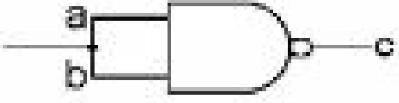

The NAND gate is the basic building block of a computer.  
 The truth table is as follows:
0,0 --> 1
0,1 --> 1
1,0 --> 1
1,1 --> 0

---

The NOT gate
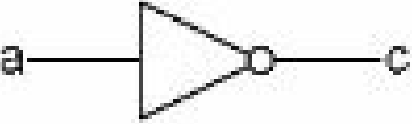
This can be combine with NAND to give us the AND gate.

---

## Remember a bit

Four nand gates can be combined to form a circuit that remembers.  
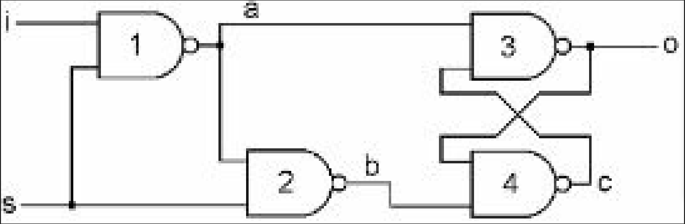

i is the input . The bit we want to remember.  
s is the setter. If its on then we can set but if its off then i has no impact.

i 0  
s 1

gate 1 1,0 go into a nand -->1 a  
gate 2 1,1 --> b 0  
gate 4 0,0 --> c 1  
gate 3 1,1--> o 0  
gate 4 0,0-->0

remember 0 which is same as input

i 1  
s 1  
nand 1,1-->0 else 1  
gate 1 1,1 -->0 a  
gate 2 1,0 --> 1 b  
gate 3 1,0, ---> 1 o  
gate 4 1,1 ---> 0 c  
gate 3 0,0 ---> 1 o

remeber 1 same as i

s 0, i 1  
a 1  
b 1

s0, i0  
a 1  
b 1

This cicuit can be abstracted by the following diagram.

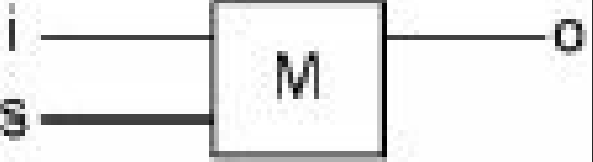

---

## Byte

8 memory bits can be combined to make a byte . The setters are connected together while the i and o are separate.

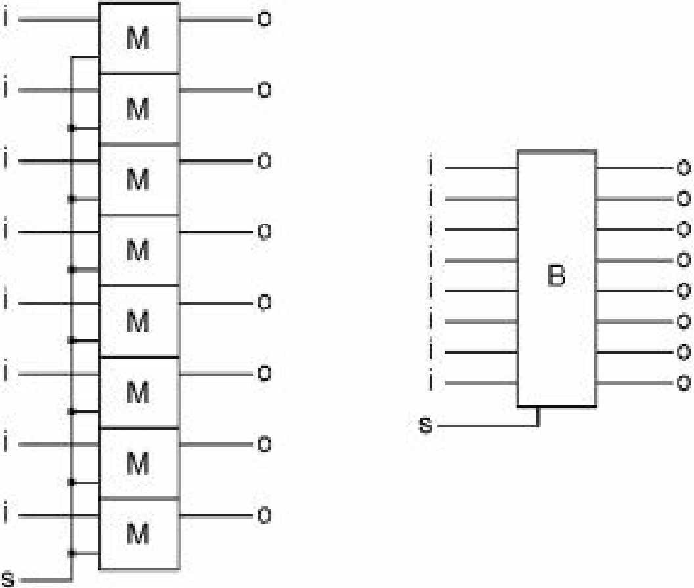

---

## Register

To read and write, an and gate is attached to the outputs of the byte and an enabler (e) creating a register (R).  
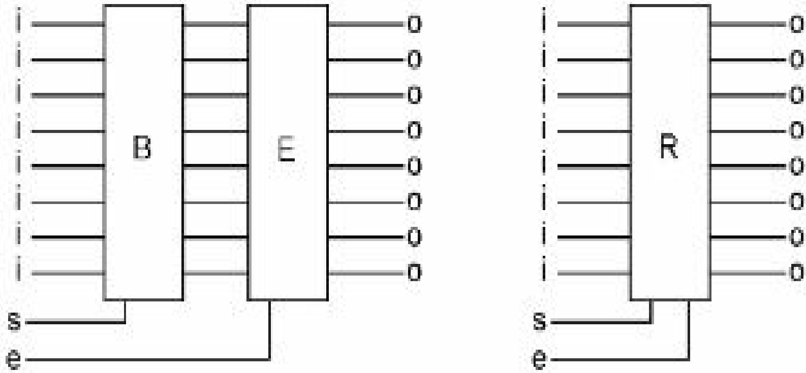

It can be simplified to :

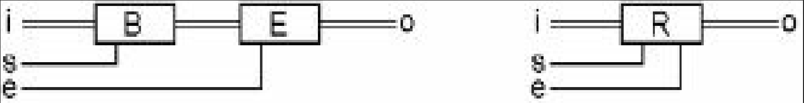

This setup however can only store the most recent value.

## Bus

A group of 8 wires connected to another group of 8 is called a bus.

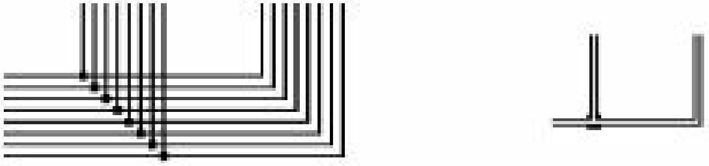

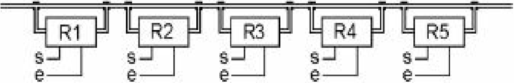

_Copying Bytes_

If you want to copy the information from R1 into R4, first you turn the ‘e’ bit of R1 on. The data in R1  
will now be on the bus, and available at the inputs of all five registers. If you then briefly turn the ‘s’ bit  
of R4 on and back off, the data on the bus will be captured into R4. The byte has been copied.

Buses can be simplified to :  
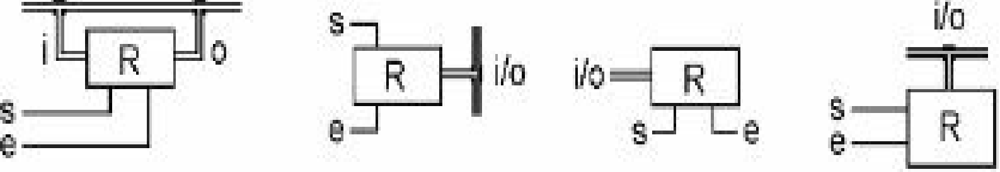

## Multiple and gates

Combining multiple and gates creates a circuit that need 3 or more inputs to be on as shown below.

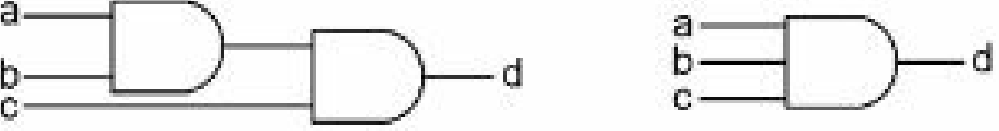

---

## First half of a comuter

MEMORY

Memory is made up of a _Memory address Register_ that is connected to a maze of memory registers via decoders.The MAR can select which of these registers it wants by activating the horizontal and vertical cicuits which will pin-point a certain register.This allows random access of the registers.

## The cpu

Messing with bytes.

_Left and right shift_ - This can be done by connecting two registers together but offsetting the inputs. eg pin 1 of reg 1 connects to pin 2 of reg 2. The overflow pins can be connected together so that the overflow wraps around.

_NOTer_ - just connect two registers with a not gate.

_ANDer_ - The ANDer takes two input bytes, and ANDs each bit of those two into a third byte.

_ORer_ -- The ORer takes two input bytes, and ORs each bit of those two into a third byte.

_XORer_ - The XORer takes two input bytes, and XORs each bit ofthose two into a third byte.

_ADDer_ - If we want to add two binary digits , An XOR of the two bits will tell us what the right column answer should be, and an AND of the two bits will tell us whether we need to carry a 1. Adding a 1,1,1 is a bit more complicatedbut there is a circuit in the book for that. The addder will have a carry in and out which can be connected to other registers to add numbers greater than 255.

_Comparator_ - compares if two nums are greater , equal or less than. It's built into the xor. To test for equality xor can be used but for <> then. You have to start with the two top bits, and if one is on and the other is off, then the one that is on is the larger number.

Logic involves deriving a third fact from two inputs eg and ,xor and the adder does math so:
Therefore the above steps dexribe the Arithmetic and Logic Unit. _ALU_  
The ALU is connected via a decoder so as to selext which \*_operation_ we want to perform.

    000 ADD Add
    001 SHR Shift Right
    010 SHL Shift Left
    011 NOT Not
    100 AND And
    101 OR Or
    110 XOR Exclusive OR
    111 CMP Compare

The accumulator is connected to the ALU. ACC receives, and temporarily stores, the result of the most recent ALU operation.

## The clock

A not gate connected to itself.
